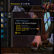
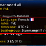
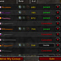
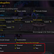

# TooltipRealmInfo (WoW AddOn)

&nbsp; &nbsp; &nbsp; &nbsp;

## Description
This AddOn appends realm infos to some tooltips which containing player names with realm name,

     

## Contains
* Realm language with country flag icons
* Realm timezone
* Realm rules (PvE or RP PvE)
* Connected realms
* Community member lists
* Community applicant lists
* Country flags on chat messages (optional - by chat type and language selectable) [new]

## Currently supported tooltips
* Player tooltips
* Group finder tooltips
* Friend list tooltips
* Community member list tooltips

## Chat command list
Available commands for /ttri or /tooltiprealminfo

Show/Hide timezone line in tooltips
> /ttri timezone

Show/Hide locale line in tooltips
> /ttri locale

Show/Hide connected realms in tooltips
> /ttri connectedrealms

Show/Hide type line in tooltips
>  /ttri type

## Credits
This addon using LibRealmInfo developed by Phanx. Big thanks @ Phanx :-)
Forked by janekjl after Phanx has stopped development on it. Thanks @ janekjl :-)

## Dependencies
* [LibStub](https://www.curseforge.com/wow/addons/libstub)
* [CallbackHandler-1.0](https://www.curseforge.com/wow/addons/callbackhandler)
* [Ace3.0](https://www.curseforge.com/wow/addons/ace3)
* [LibRealmInfo](https://github.com/janekjl/LibRealmInfo) from janekjl. Prev. [LibRealmInfo](https://github.com/Phanx/LibRealmInfo) from Phanx

## My other projects
* [On Curseforge](https://www.curseforge.com/members/hizuro_de/projects)
* [On Github](https://github.com/hizuro?tab=repositories)

## Disclaimer
> World of Warcraft© and Blizzard Entertainment© are all trademarks or registered trademarks of Blizzard Entertainment in the United States and/or other countries. These terms and all related materials, logos, and images are copyright © Blizzard Entertainment. The author of this addon is in no way associated with or endorsed by Blizzard Entertainment ©
